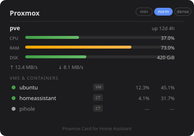

# Proxmox Card for Home Assistant



A Lovelace card that displays Proxmox VE node, VM, and container stats using the official [Proxmox VE integration](https://www.home-assistant.io/integrations/proxmoxve/).

## Features

- Node stats: CPU, RAM, disk usage bars, uptime, network in/out
- VM and container list with running status, CPU%, RAM%
- Three display modes: **minimal**, **normal**, **dense**
- Fully theme-aware — uses your active HA theme's CSS variables
- Auto-discovers all Proxmox entities from the integration

## Prerequisites

Install and configure the **Proxmox VE** integration in Home Assistant:
`Settings → Devices & Services → Add Integration → Proxmox VE`

## Installation

### Via HACS (recommended)

1. Open HACS → Frontend
2. Click the three-dot menu → Custom repositories
3. Add `https://github.com/flejz/hass-proxmox-widget` as type **Dashboard**
4. Install **Proxmox Card**
5. Add to your dashboard resources (HACS does this automatically)

### Manual

1. Download `proxmox-card.js` from the [latest release](https://github.com/flejz/hass-proxmox-widget/releases/latest)
2. Copy to `config/www/proxmox-card.js`
3. Add resource in `Settings → Dashboards → Resources`:
   - URL: `/local/proxmox-card.js`
   - Type: JavaScript module

## Usage

```yaml
type: custom:proxmox-card
title: Proxmox          # optional, default: "Proxmox"
mode: normal            # optional: minimal | normal | dense (default: normal)
exclude:                # optional: entity IDs to hide
  - binary_sensor.some_entity
```

### Display Modes

| Mode | Node stats | VM stats | Network |
|------|-----------|----------|---------|
| minimal | CPU + RAM | status dot + name only | — |
| normal | CPU + RAM + disk + uptime | status + type + CPU% + RAM% | ↑↓ |
| dense | CPU + RAM + disk | status + type + CPU% + RAM% | — |

The mode switcher buttons in the card header override the config `mode` at runtime (resets on page reload).

## Development

```bash
npm install
npm run build   # outputs dist/proxmox-card.js
npm run dev     # watch mode
```

Requires Node.js 18+.
